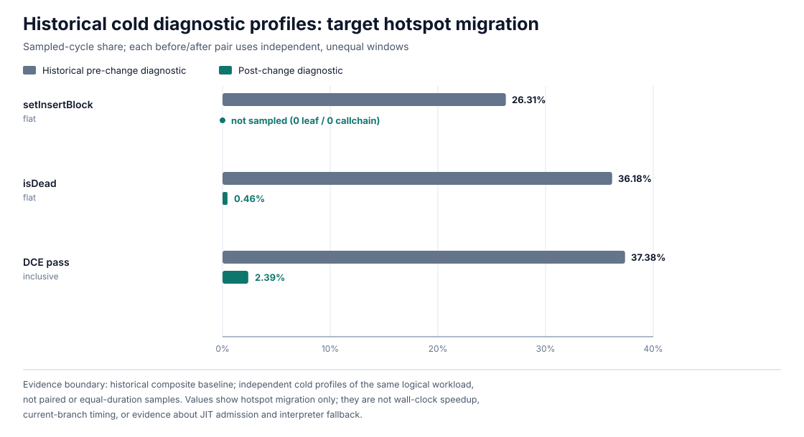

# Change: bound JIT compiler membership and use-chain scans

- **Status**: Implemented
- **Date**: 2026-07-22
- **Tier**: Light

## Overview

This change replaces one repeated linear search and narrows one repeated chain
scan in the EVM frontend and shared multipass JIT backend:

1. `EVMMirBuilder::setInsertBlock` now tests deterministic MIR (dMIR)
   basic-block membership with the block's stable index and pointer identity
   instead of searching the function's block vector.
2. Code-generation IR (CgIR) dead-instruction elimination now uses the
   register use-def chain's ordering invariant to inspect only the use suffix
   from the chain tail.

Both changes reduce work inside compilation while preserving the existing IR
and dead-code semantics. They do not change JIT admission, interpreter
fallback, EVM execution behavior, or public APIs. No current-branch
wall-clock speedup has been established.

## Motivation

Historical cold diagnostic profiles identified block-membership lookup and
dead-instruction liveness checks as concentrated compiler costs. Both queries
were broader than their required answers: the frontend needs only a membership
test, while DCE needs only to find a use outside the candidate instruction.
The existing dMIR block index and CgIR list ordering provide those answers
without changing compilation decisions.

## Changes

### Indexed dMIR basic-block membership

`MFunction::appendBlock` assigns each appended `MBasicBlock` an index equal to
its position in `BasicBlocks`. `MFunction::containsBasicBlock` therefore checks
membership with two conditions:

```cpp
BBIdx < BasicBlocks.size() && BasicBlocks[BBIdx] == BB
```

The pointer comparison distinguishes an unappended block whose default index
is zero from the function's actual entry block. Under the existing append-only
block-list contract, the membership check changes from `O(number of blocks)`
to `O(1)`.

### CgIR DCE use-suffix scan

`CgRegisterInfo` stores definitions as a prefix of each register's use-def list
and uses as a suffix. The list head's circular `Prev` link points to the tail.
`hasUseOutside` starts at that tail, walks backward while operands are uses,
and stops at the first definition. An explicit head check terminates the
all-use circular-list case.

`CgDeadCgInstructionElim::isDead` needs only one answer: whether a virtual
register has a use in an instruction other than the candidate instruction.
The new helper avoids traversing the definition prefix and can return on the
first external use. Its worst-case work is proportional to the number of uses,
not the total number of definitions and uses. This is a bounded local scan
reduction, not a new global complexity bound for the DCE pass.

## Correctness invariants

| Invariant | Enforcement and coverage |
|---|---|
| An appended dMIR block's index equals its vector position. | `appendBlock` writes the index immediately before appending; current mutation paths do not reorder or erase appended blocks. |
| A default or colliding index does not imply membership. | `containsBasicBlock` also compares the pointer stored at that index. |
| CgIR definitions precede uses in each register chain. | `addRegOperandToUseList` inserts definitions at the front and uses at the back; operand-kind changes unlink and reinsert the operand. |
| Reverse traversal cannot wrap around an all-use chain. | `hasUseOutside` stops when the current operand is the list head. |
| Uses in the candidate instruction do not keep that instruction alive. | The helper compares each use's parent with the candidate instruction. |
| Uses in another block keep definitions alive. | The DCE regression test places the external use in a second connected `CgBasicBlock`, then removes it and verifies both blocks become empty after DCE. |

## Impact

The implementation changes five compiler and test files:

- `src/compiler/mir/function.h`
- `src/compiler/evm_frontend/evm_mir_compiler.h`
- `src/compiler/cgir/pass/cg_register_info.h`
- `src/compiler/cgir/pass/dead_cg_instruction_elim.cpp`
- `src/tests/evm_jit_frontend_tests.cpp`

The indexed membership check is limited to the EVM frontend. The DCE helper is
in the shared CgIR backend and is used by both EVM and WASM multipass
compilation. Generated-code eligibility, admission thresholds, interpreter
fallback reasons, module-cache behavior, gas accounting, and runtime host
calls are unchanged. The existing compiler module specification already
describes the affected dMIR and CgIR ownership contracts; no module-level
contract changes.

## Diagnostic hotspot migration

> **Evidence boundary.** The values below come from separate cold diagnostic
> profiles associated with an older composite experiment baseline. The
> sampling windows were neither paired nor equal in duration. These
> sampled-cycle shares show that the target scans ceased to dominate those
> diagnostic profiles; they are not a wall-clock decomposition, a current
> branch speedup measurement, or evidence about JIT admission and interpreter
> fallback.



| Profile view | Historical pre-change diagnostic | Post-change diagnostic |
|---|---:|---:|
| `EVMMirBuilder::setInsertBlock`, flat | 26.31% | not sampled: 0 leaf and 0 callchain samples |
| `CgDeadCgInstructionElim::isDead`, flat | 36.18% | 0.46% |
| DCE pass, inclusive | 37.38% | 2.39% |

The membership profiles used the same logical one-block workload but different
sampling windows and rates. The DCE profiles also used independent, unequal
cold-process windows; the post-change artifact does not bind its perf binary to
a source commit strongly enough for a formal release claim.

A separate 2026-07-22 exact-head gate on current `upstream/main` sampled 20
independent cold processes and found no `setInsertBlock` leaf samples in the
baseline. The pre-registered protocol therefore stopped before profiling the
indexed variant and did not run timing. This current-main result reinforces the
scope above: the historical 26.31% value is migration context, not a current
baseline.

## Verification

| Gate | Result |
|---|---:|
| `evmJitFrontendTests` | 42/42 |
| `evmDifferentialTests` | 53/53 |
| multipass `evmone-unittests` | 223/223 |
| multipass `evmone-statetest -k fork_Cancun` | 2723/2723 |
| EVM assembly tests | 209/209 |
| CTest targets | 12/12 |
| WASM multipass smoke, `add(2, 3)` | `0x5:i32`, matching the pre-change baseline |

The regression coverage includes block-index and pointer-identity membership,
reselecting an appended entry block, definition-only and use-only register
chains, self-use, cross-instruction and cross-block uses, chain removal, and
end-to-end DCE behavior.

Repository-wide `tools/format.sh check` remains blocked by 26 unchanged
baseline files. A targeted `clang-format --dry-run --style=file -Werror` check
passes for all five changed C/C++ files. The rebuild emitted two existing
warnings outside the changed lines: one from LLVM 15 dominator-tree templates
and one unused function in `cg_inline_spiller.cpp`; no new warning appeared in
the changed files.

## Checklist

- [x] Implementation complete
- [x] Tests added or updated
- [x] Compiler module contracts unchanged
- [x] Relevant build and correctness gates pass
- [x] Performance evidence is limited to diagnostic hotspot migration
